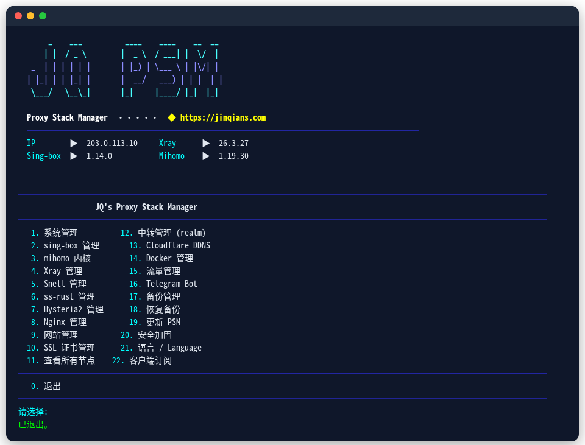
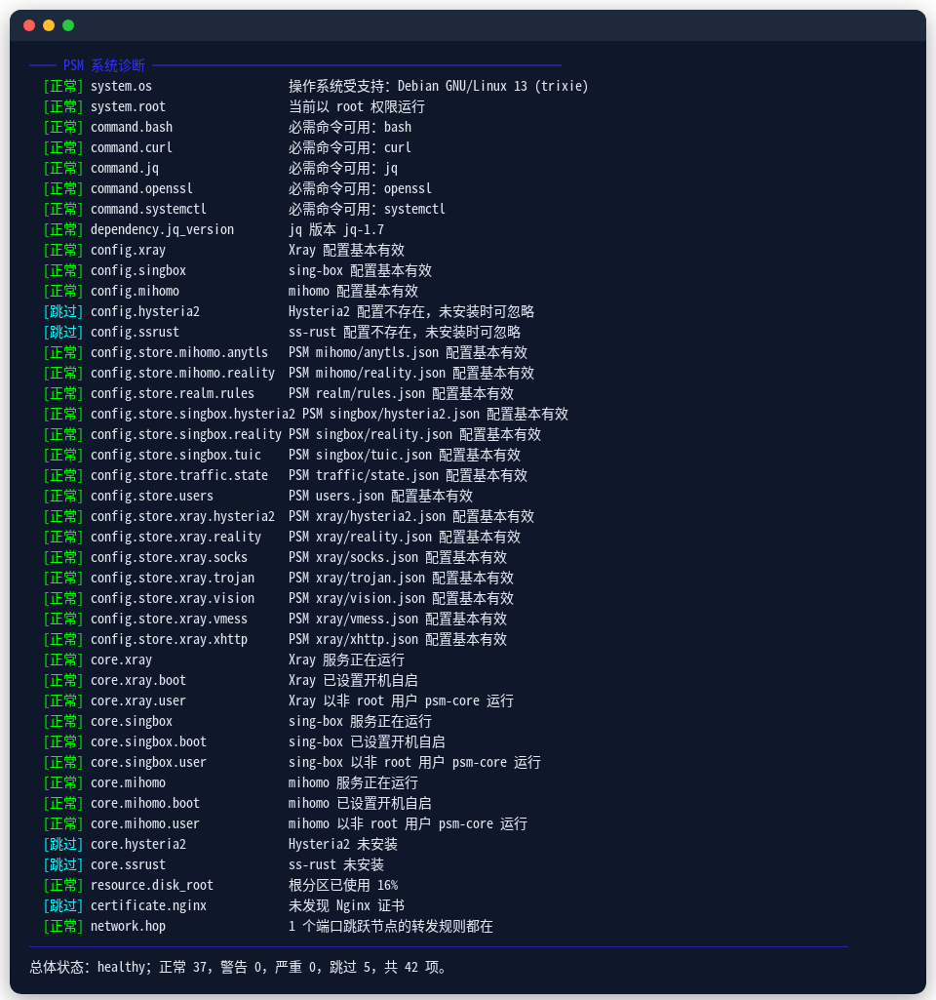

<div align="center">


# PSM · VPS 科学上网一键管理脚本

**一键搭建 VLESS REALITY、Hysteria2、Snell、TUIC、AnyTLS、Shadowsocks 2022(SS2022) 节点**<br>
Xray / sing-box / mihomo 三内核 · 443 端口复用 · 多用户 · 流量配额 · 一键迁移

<p>
  <a href="https://github.com/jinqians/proxy-stack/actions/workflows/ci.yml"></a>
  
  
  
</p>

<p>
  <a href="https://psm-docs.pages.dev"><b>📖 使用文档</b></a> ·
  <a href="https://psm-docs.pages.dev/guide/quick-start">1 分钟快速开始</a> ·
  <a href="https://psm-docs.pages.dev/faq">常见问题</a> ·
  <a href="README_EN.md">English</a>
</p>

</div>

## 一键安装

在 VPS 上以 root 执行：

```bash
bash <(curl -fsSL https://psm.jinqians.com)
```

装好后输入 `psm` 打开管理菜单。Alpine 用 `wget -qO- https://psm.jinqians.com | sh`。

<p align="center">
  
</p>

## 能做什么

| | |
| --- | --- |
| 🛡️ **主流抗封锁协议** | VLESS REALITY / Vision / XHTTP、Hysteria2（端口跳跃）、TUIC v5、AnyTLS、Snell、Shadowsocks 2022、Trojan、VMess、WireGuard |
| 🧩 **三个内核随意选** | Xray、sing-box、mihomo 可同时运行，[怎么选](https://psm-docs.pages.dev/guide/cores) |
| 🔒 **443 端口复用** | 多个节点共用一个 443，未知域名直接断开，[了解更多](https://psm-docs.pages.dev/features/port-443) |
| 📱 **链接、二维码、订阅** | v2rayN、Clash Verge Rev、Shadowrocket、sing-box、Surge 等客户端直接导入 |
| 👥 **多用户** | 每人独立凭据、到期时间和订阅，按月限流量，[了解更多](https://psm-docs.pages.dev/features/users) |
| 🎬 **解锁 Netflix / ChatGPT** | WARP、家宽 IP 出口 + 规则集分流 |
| 📦 **一键迁移服务器** | `psm migrate push root@新服务器`，客户端不用改 |
| 🩺 **自动诊断修复** | `psm doctor --fix` 修服务、证书、开机自启和转发规则 |
| 🔐 **安全** | 内核以非 root 运行、SSH 加固、Fail2ban、蜜罐 |

<table>
  <tr>
    <td></td>
    <td></td>
  </tr>
  <tr>
    <td align="center">诊断与自动修复</td>
    <td align="center">多用户</td>
  </tr>
</table>

## 常用命令

```bash
psm                                         # 打开菜单
psm node add xray reality --tag hk --port 443 \
  --server-name 伪装域名 --dest 伪装域名:443   # 建一个 REALITY 节点
psm node export xray reality hk             # 分享链接
psm user add alice --days 30 --quota 100G   # 给 alice 开账号
psm doctor --fix                            # 诊断并修复
psm migrate push root@新服务器               # 搬到新 VPS
```

完整命令见 [命令参考](https://psm-docs.pages.dev/reference/cli)。

## 支持的系统

Debian、Ubuntu、Alpine、RHEL / CentOS / Rocky Linux / AlmaLinux 等，x86_64 与 arm64。每次提交都在 **Debian 13、Ubuntu 24.04 / 22.04、Alpine 3.22、Rocky Linux 9、AlmaLinux 8** 上跑完整测试。详见 [支持的系统](https://psm-docs.pages.dev/reference/systems)。

## 常见问题

- **需要域名吗？** REALITY 不需要，只有 IP 就能用。[更多](https://psm-docs.pages.dev/faq#domain)
- **协议怎么选？** 先上 REALITY，网络差再加 Hysteria2。[更多](https://psm-docs.pages.dev/guide/choose-protocol)
- **节点连不上？** 先跑 `psm doctor --fix`，再检查云服务商安全组。[更多](https://psm-docs.pages.dev/faq#not-working)
- **IP 被封了？** 换台 VPS，`psm migrate push` 一条命令搬过去。[更多](https://psm-docs.pages.dev/features/migrate)

## 捐赠

如果这个项目对你有帮助，欢迎请作者喝杯咖啡 ☕️（USDT）：

| 网络 | 地址 |
| --- | --- |
| **TRC20** | `TUe1x22n9FPAgLt6YFcQyxWgvTZFNgKBgM` |
| **Polygon** | `0x5632f6d76a03543c53d750918c9c6a4c372f1597` |

## 许可证

[AGPL-3.0](LICENSE)。请在当地法律允许的范围内使用。更新记录见 [CHANGELOG](CHANGELOG.md)。
