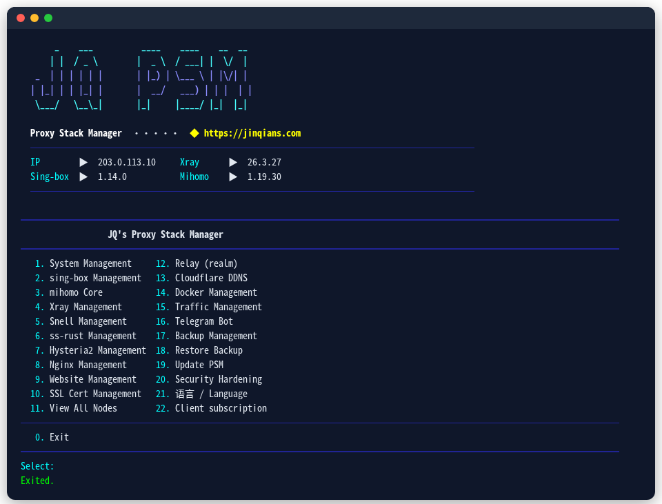
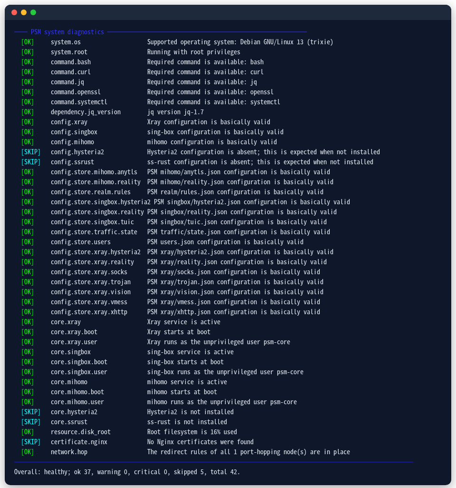
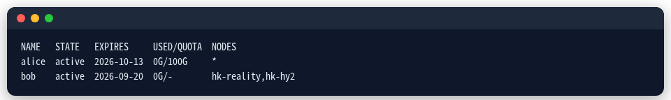

<div align="center">


# PSM · Proxy Stack Manager

**Your own proxy server on a VPS, in one command: VLESS REALITY, Hysteria2, TUIC, AnyTLS**<br>
Xray / sing-box / mihomo · port 443 sharing · per-user accounts · traffic quotas · server migration

<p>
  <a href="https://github.com/jinqians/proxy-stack/actions/workflows/ci.yml"></a>
  
  
  
</p>

<p>
  <a href="https://psm-docs.pages.dev/en/"><b>📖 Documentation</b></a> ·
  <a href="https://psm-docs.pages.dev/en/guide/quick-start">Quick start</a> ·
  <a href="https://psm-docs.pages.dev/en/faq">FAQ</a> ·
  <a href="README.md">简体中文</a>
</p>

</div>

## Install

As root on your VPS:

```bash
bash <(curl -fsSL https://psm.jinqians.com)
```

Then run `psm` to open the menu. On Alpine: `wget -qO- https://psm.jinqians.com | sh`.

<p align="center">
  
</p>

## What it does

| | |
| --- | --- |
| 🛡️ **Censorship-resistant protocols** | VLESS REALITY / Vision / XHTTP, Hysteria2 with port hopping, TUIC v5, AnyTLS, Snell, Shadowsocks 2022, Trojan, VMess, WireGuard |
| 🧩 **Three cores** | Xray, sing-box and mihomo, side by side if you like; [which to pick](https://psm-docs.pages.dev/en/guide/cores) |
| 🔒 **Share port 443** | many nodes on one port 443, unknown names dropped; [how](https://psm-docs.pages.dev/en/features/port-443) |
| 📱 **Links, QR codes, subscriptions** | for v2rayN, Clash Verge Rev, Shadowrocket, sing-box and other clients |
| 👥 **Per-user accounts** | own credentials, expiry and subscription per person, monthly quotas; [how](https://psm-docs.pages.dev/en/features/users) |
| 🎬 **Unlock Netflix / ChatGPT** | WARP and residential exits, routed by rule set |
| 📦 **Move servers** | `psm migrate push root@new-server`, clients keep working |
| 🩺 **Diagnose and repair** | `psm doctor --fix` fixes services, certificates, boot start and redirect rules |
| 🔐 **Secure** | cores run unprivileged, SSH hardening, Fail2ban, honeypots |

<table>
  <tr>
    <td></td>
    <td></td>
  </tr>
  <tr>
    <td align="center">Diagnose and repair</td>
    <td align="center">Per-user accounts</td>
  </tr>
</table>

## Everyday commands

```bash
psm                                         # open the menu
psm node add xray reality --tag hk --port 443 \
  --server-name TARGET --dest TARGET:443    # a REALITY node
psm node export xray reality hk             # its share link
psm user add alice --days 30 --quota 100G   # an account for alice
psm doctor --fix                            # diagnose and repair
psm migrate push root@new-server            # move to a new VPS
```

All commands: [CLI reference](https://psm-docs.pages.dev/en/reference/cli).

## Supported systems

Debian, Ubuntu, Alpine and RHEL / CentOS / Rocky Linux / AlmaLinux, on x86_64 and arm64. Every commit runs the full test suites on **Debian 13, Ubuntu 24.04 / 22.04, Alpine 3.22, Rocky Linux 9 and AlmaLinux 8**. Details: [Supported systems](https://psm-docs.pages.dev/en/reference/systems).

## FAQ

- **Do I need a domain?** Not for REALITY; an IP is enough. [More](https://psm-docs.pages.dev/en/faq#domain)
- **Which protocol?** REALITY first, Hysteria2 for lossy networks. [More](https://psm-docs.pages.dev/en/guide/choose-protocol)
- **A node does not connect?** Run `psm doctor --fix`, then check your cloud security group. [More](https://psm-docs.pages.dev/en/faq#not-working)
- **The IP got blocked?** Get a new VPS and `psm migrate push` everything over. [More](https://psm-docs.pages.dev/en/features/migrate)

## Donate

If PSM helps you, you can buy the author a coffee ☕️ (USDT):

| Network | Address |
| --- | --- |
| **TRC20** | `TUe1x22n9FPAgLt6YFcQyxWgvTZFNgKBgM` |
| **Polygon** | `0x5632f6d76a03543c53d750918c9c6a4c372f1597` |

## License

[AGPL-3.0](LICENSE). Use it within the law where you live. Release notes: [CHANGELOG](CHANGELOG.md).
