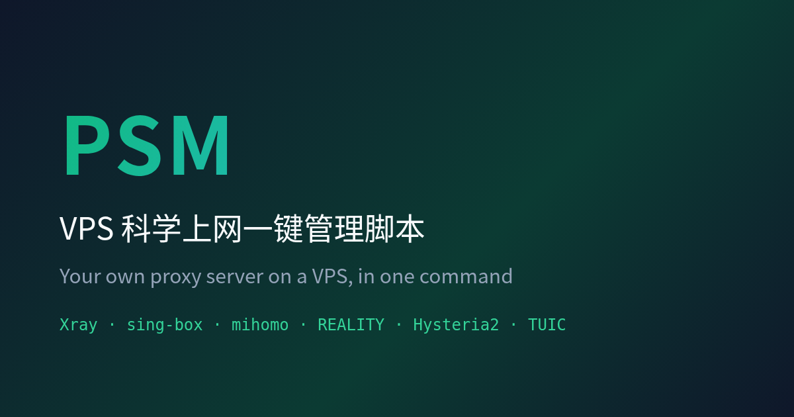

<div align="center">



# PSM · Proxy Stack Manager

**Свой прокси-сервер на VPS одной командой: VLESS REALITY, Hysteria2, TUIC, AnyTLS**<br>
Xray / sing-box / mihomo · общий порт 443 · учётные записи · лимиты трафика · перенос сервера

<p>
  <a href="https://psm-docs.pages.dev/en/"><b>📖 Документация (English)</b></a> ·
  <a href="README_EN.md">English</a> ·
  <a href="README.md">简体中文</a>
</p>

</div>

## Установка

На VPS от root:

```bash
bash <(curl -fsSL https://psm.jinqians.com)
```

Затем запустите `psm`, откроется меню. Интерфейс есть на русском (пункт «Language» в меню).

## Возможности

- VLESS REALITY / Vision / XHTTP, Hysteria2 (перескок портов), TUIC v5, AnyTLS, Snell, Shadowsocks 2022, Trojan, VMess, WireGuard
- Три ядра — Xray, sing-box и mihomo — можно запускать одновременно
- Несколько узлов на одном порту 443
- Ссылки, QR-коды, подписки
- Учётные записи с датой окончания и месячным лимитом трафика
- Перенос сервера: `psm migrate push root@новый-сервер`
- Диагностика и автоисправление: `psm doctor --fix`

Системы: Debian, Ubuntu, Alpine, RHEL / Rocky Linux / AlmaLinux (x86_64, arm64).

Подробности — в [документации на английском](https://psm-docs.pages.dev/en/).

## Лицензия

[AGPL-3.0](LICENSE). Используйте в рамках законов вашей страны.
